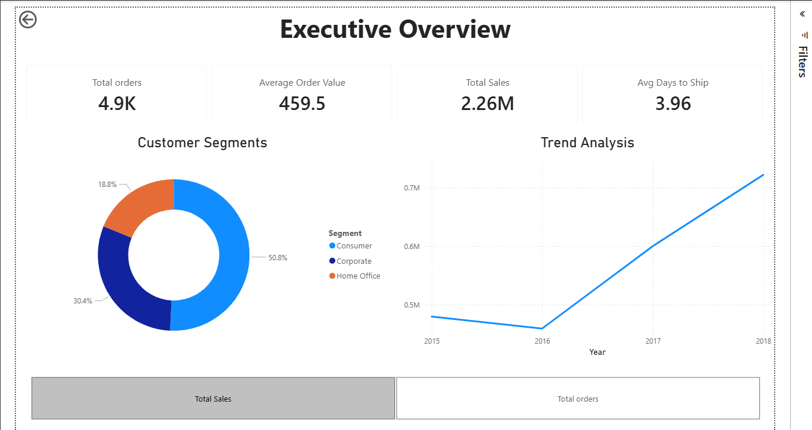
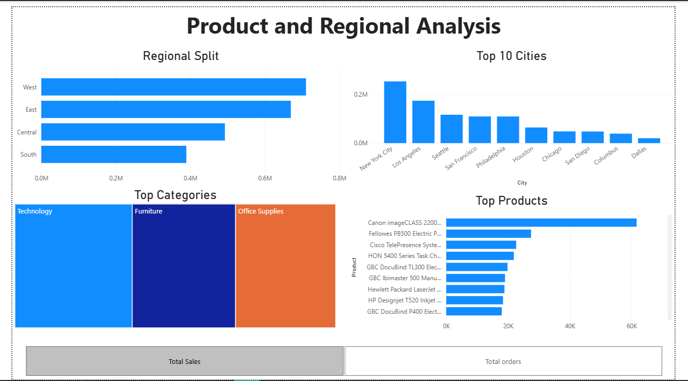

# Superstore Sales & Performance Power BI Dashboard

An interactive two-page Power BI business intelligence report analyzing sales revenue, customer segmentation, fulfillment lead times, and regional product trends for a retail superstore.

---

## 📊 Dashboard Overview

### Page 1: Executive Overview




* **KPI Header:** Tracks core business health indicators including **Total Sales ($2.26M)**, **Total Orders (4.9K)**, **Average Order Value ($459.5)**, and (3.96) **Average Days to Ship**.
* **Customer Segments:** Donut chart evaluating revenue and volume contribution across **Consumer (51.5%)**, **Corporate (30.3%)**, and **Home Office (18.2%)** segments.
* **Trend Analysis:** Multi-level time-series line chart tracking performance across years (2015–2018) with built-in drill-down to Quarter and Month levels.
* **Dynamic Metric Switcher:** Single-select parameter toggle enabling instant switching between **Total Sales** and **Total Orders** across all relevant visuals.

### Page 2: Product & Regional Analysis



* **Regional Split:** Horizontal bar chart comparing demand across US regions (**West**, **East**, **Central**, **South**).
* **Top 10 Cities:** High-volume geographic breakdown highlighting key revenue centers (New York City, Los Angeles, Philadelphia, San Francisco, Seattle).
* **Category Breakdown:** Treemap visualization outlining product volume distribution across **Office Supplies**, **Furniture**, and **Technology**.
* **Top Products:** Ranked bar chart showcasing the top-performing individual items by order volume and revenue.

---

## 🛠️ Data Modeling & DAX Measures

Key DAX calculations used in this report:

* **Total Orders (Distinct Count):**
  ```dax
  Total Orders = DISTINCTCOUNT('train'[Order ID])

* **Average Order Value:**
  ```dax
  Average Order Value = DIVIDE([Total Sales], [Total Orders], 0)

* **Average Days to Ship:**
  ```dax
  Avg Days to Ship = 
AVERAGEX(
    'train',
    DATEDIFF('train'[Order Date], 'train'[Ship Date], DAY)
)

* **Dynamic Field Parameter:**
  ```dax
  Filter = {
    ("Total orders", NAMEOF('train'[Total Orders]), 0),
    ("Total Sales", NAMEOF('train'[Total Sales]), 1)
}

---

## 📁 Repository Contents

* `Superstore_Dashboard.pbix` — Interactive two-page Power BI report featuring dynamic field parameters, time-series drilldowns, and responsive visual formatting.
* `train.csv` — Transactional superstore dataset comprising 9,800 line items (4,922 unique orders) across 18 dimensional attributes and performance metrics.
* `README.md` — Project documentation detailing data architecture, DAX formulas, dashboard architecture, and analytical findings.

---

## 🚀 Key Insights & Takeaways

* **Core Financials & Order Scale:** The store generated **$2.26M** in total revenue across **4,922 distinct orders**, yielding an **Average Order Value (AOV)** of **$459.48** and a median fulfillment window of **3.96 days**.
* **Customer Segment Dominance:** The **Consumer** segment represents the primary revenue engine, accounting for **50.8%** ($1.15M) of total sales, followed by **Corporate** at **30.4%** ($688.5K) and **Home Office** at **18.8%** ($424.9K).
* **Revenue vs. Volume Dynamics:** While **Office Supplies** drives the highest purchase frequency (**5,909** line items; ~60% of all catalog selections), **Technology** commands the largest revenue contribution at **36.6%** ($827.5K) due to higher per-unit prices.
* **Geographic Concentration:** Sales distribution is heavily concentrated in coastal commercial hubs; **New York City** ($252.5K) and **Los Angeles** ($173.4K) alone generate nearly **19%** of total business revenue.
